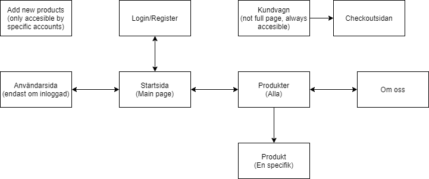
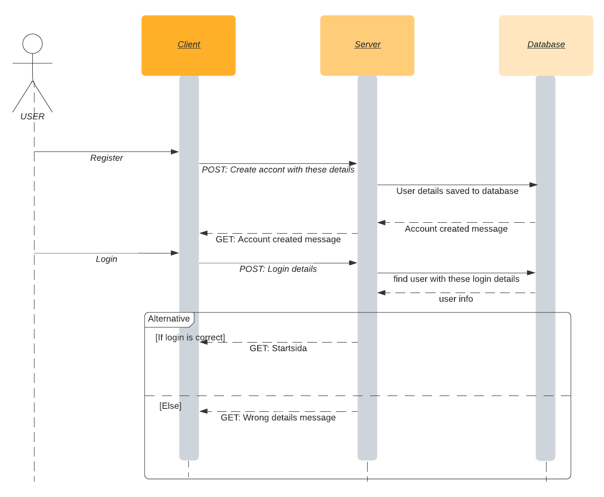
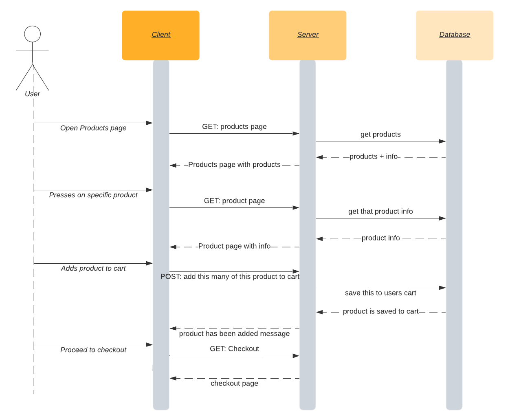
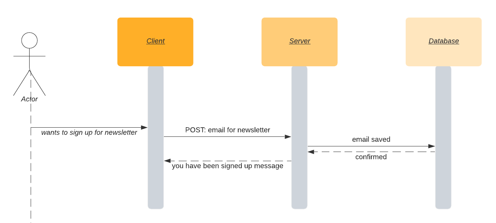

# Webbshop för doftljus

## Tekniken 
- NodeJS (Backend, serverside)
- EJS (Server Side Rendering)
- VUEJS (Frontend, User Interface)
- Bootstrap (Frontend, Styling)
- MongoDB (Databas)

## Databasens innehåll
- Användare
- Produkter (pris, antal på lager, osv)

Databasens uppgift är alltså att hålla koll alla tillgängliga produkter och hur deras status är. Alla skapade användarkonton kommer också att sparas här.

## Färgschema & Typsnitt
### Färger
-

### Typsnitt
-

## Platsstruktur

## Sekvensdiagram

### Registrering/Inloggning

### Shopping upplevelsen

### Registrera sig för nyhetsbrevet

## Wireframes

### Startsida

### osv

## Målgrupp & Persona 

### Målgrupp
- Kön: Kvinnor och män (främst kvinnor)
- Ålder: Mellan 20 och 45 år
- Pengasituation: Genomsnittlig lön
- Bostadsituation: Har egen bostad

### Persona
#### Maria 
Hon är en kvinna i 35 år åldern med en genomsnittlig lön. Själv har hon två barn och en villa. Hon älskar doftljus eftersom dem är ett lätt sätt att få hennes hus att luckta gott, men hon vill ha tid att spendera med sina barn. Därför vill hon kunna köpa doftljus snabbt fort och lätt online. 
