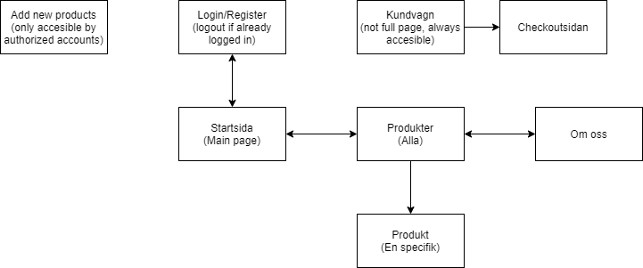

# Webbshop för doftljus

## Tekniken 
- NodeJS (Backend, serverside)
- EJS (Server Side Rendering)
- VUEJS (Frontend, User Interface)
- Bootstrap (Frontend, Styling)
- MongoDB (Databas)

## Databasens innehåll
- Användare
- Produkter (pris, antal på lager, osv)

Databasens uppgift är alltså att hålla koll alla tillgängliga produkter och hur deras status är. Alla skapade användarkonton kommer också att sparas här.

## Färgschema & Typsnitt
### Färger
-

### Typsnitt
-

## Platsstruktur

## Sekvensdiagram

### Registrering/Inloggning

### Shopping upplevelsen

### Registrera sig för nyhetsbrevet

## Wireframes

### Startsida
telefon https://wireframe.cc/s51UGT
dator https://wireframe.cc/dOVhKD

### osv

## Målgrupp & Persona 

### Målgrupp
- Kön: Kvinnor och män (främst kvinnor)
- Ålder: Mellan 20 och 55 år
- Vill enkelt kunna köpa doftljus hemmifrån

### Persona
#### Maria 35
Efter en lång arbetsvecka vill Maria komma hem till ett trevligt hem där hon kan slappna av. En viktig grej för att henne är att det ska lukta gott, och efter en lång arbetsvecka vill hon snabbt fort och lätt kunna beställa doftljus hemmifrån så hon slipper åka till affären.
